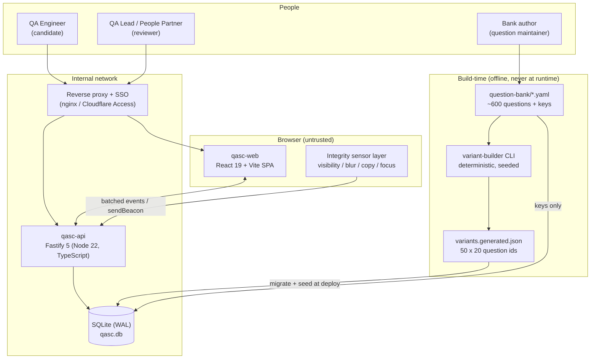
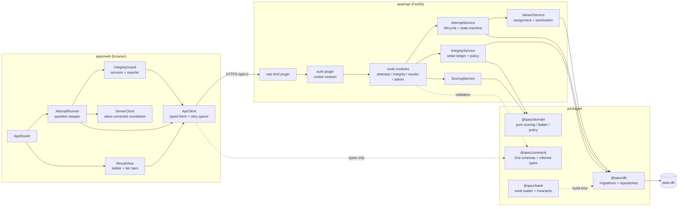
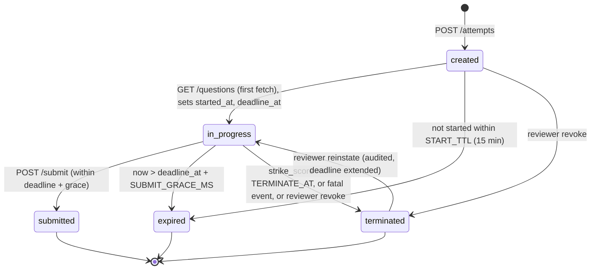

# QA Seniority Checker — Architecture

**Status:** Approved design baseline (v1.0)
**Audience:** the implementation agent(s) building this repo from scratch.
**Scope:** internal web platform, ~200 QA engineers, low concurrency (peak ≈ 30 simultaneous attempts), single deployment, single database file.

This document is normative. Where it says MUST, the implementation has no discretion. Where it says SHOULD, deviation requires a note in the PR description.

---

## 1. Product summary

A QA engineer opens the app, authenticates against the internal identity, and is assigned **one of 50 pre-built test variants**. Each variant is 20 multiple-choice questions drawn from a bank of ~600, following a fixed difficulty blueprint of **4 trainee + 6 junior + 6 middle + 4 senior**. The attempt is timed by the server. The browser never receives correct answers. Leaving the page is treated as a cheating signal and can terminate the attempt. On submission the server scores four tier percentages (grey/green/yellow/red) and maps them onto a 9-step seniority ladder used as an input to the formal Performance Review.

Three non-negotiable properties drive nearly every decision below:

1. **The server is the only authority.** Timer, scoring, integrity verdict, and question-set membership all live server-side. The client is a rendering surface and a sensor array, nothing more.
2. **Answer keys never cross the network before submission.** Not in the question payload, not in a source map, not in a cached bundle, not in an error message.
3. **Integrity events are evidence, not verdicts.** The client reports observations; the server decides what they mean. This is what makes the anti-cheat resistant to a tampered client and, equally important, forgiving of a flaky laptop.

---

## 2. System context



**Key context decision:** the variant set is built **offline** by a CLI and committed as a generated artifact, not computed at runtime. This makes variants reproducible, reviewable in a PR diff, and testable as data. Runtime never runs a selection algorithm, so a bug in it cannot produce an unbalanced live test.

---

## 3. Component diagram



Note the dotted edge: `@qasc/contracts` is the only package the browser bundle shares with the API, and it contains **no answer keys and no scoring logic** — only request/response shapes. `@qasc/domain` (which knows the ladder thresholds and the strike policy) is imported by the API only. The ladder thresholds are not secret, but keeping `@qasc/domain` out of the web bundle guarantees no future refactor can accidentally drag a key-aware helper into the client.

---

## 4. Stack

### 4.1 Chosen

| Layer | Choice | Why |
|---|---|---|
| Language | TypeScript 5.7, `strict: true`, `noUncheckedIndexedAccess: true` | One language across sensor code, API, scoring and the variant builder. The scoring model is the product; sharing its types with the UI at compile time is worth more than any runtime win from another language. |
| Runtime | Node 22 LTS, ESM only | Native `fetch`, stable test runner ecosystem, `better-sqlite3` prebuilds. |
| Monorepo | pnpm workspaces + Turborepo for task orchestration | pnpm's strict node_modules prevents `apps/web` from silently importing `@qasc/domain`'s transitive deps — a real safety property here, not just tidiness. Turbo gives cached `build → test → lint` graphs; it is optional and can be dropped for plain `pnpm -r` if it fights us. |
| SPA | React 19 + Vite 6 | The test runner UI is a stateful single-page stepper with a global sensor layer — exactly React's sweet spot. Vite gives fast dev and, importantly, a build we fully control (no framework-managed server that might inline data). |
| Routing / data | React Router 7 (data router) + TanStack Query 5 | Query's mutation retry + offline queue is most of the "network drop must not look like cheating" requirement, for free. |
| API | Fastify 5 | Schema-first by design: every route declares Zod-derived JSON Schema, so validation and serialisation are enforced by the framework rather than by convention. The **response serialisation** matters here — Fastify's `fast-json-stringify` compiles a response schema that *drops unknown properties*, which is a structural defence against leaking `correct_option_id`. That single property is why Fastify beats Express for this product. |
| Validation | Zod 3 + `fastify-type-provider-zod` | One schema drives runtime validation, TS types, and the OpenAPI doc. |
| Persistence | SQLite via `better-sqlite3`, WAL mode, `foreign_keys=ON` | Peak load is tens of concurrent attempts and writes are tiny. Synchronous better-sqlite3 calls are *faster* than an async driver at this scale and make transactions trivially correct: `db.transaction(...)` is a real, non-interleaved critical section, which is exactly what submit-once and strike-accounting need. |
| Query layer | Kysely (typed SQL builder) over hand-written SQL for the few hot paths | Typed column names without an ORM's opinions about identity or migrations. |
| Migrations | Plain numbered `.sql` files applied by a tiny runner in `@qasc/db` | Auditable, reviewable, no framework lock-in. |
| Auth | Cookie session (`HttpOnly`, `Secure`, `SameSite=Strict`) issued after SSO header trust at the proxy | The app is behind internal SSO; the API must not invent its own password store. |
| Tests | Vitest 3 (unit + integration), `fast-check` (property), Playwright (a small E2E set) | Vitest runs the same TS config as the source; `fast-check` is where the bank/variant invariants live. |
| Logging | Pino (Fastify built-in), JSON to stdout | Integrity forensics need structured logs. |
| Formatting/lint | Biome | One tool, fast, no ESLint plugin archaeology. |

### 4.2 Explicitly rejected

| Rejected | Instead of | Reason |
|---|---|---|
| **Next.js / Remix (fullstack framework)** | React + Vite + separate Fastify | Server components and loaders blur the client/server boundary — the exact boundary this product must keep razor-sharp. A loader returning a question row with one extra column silently ships the answer key into the RSC payload. A physically separate API with compiled response schemas makes that class of bug structurally impossible. |
| **Express** | Fastify | No response-schema serialisation, weaker async error handling, slower. Express would put "don't leak the key" back into human discipline. |
| **PostgreSQL** | SQLite | Real cost (a service to run, back up, and secure) for zero benefit at 30 concurrent users. SQLite in WAL mode handles this workload with a rounding error of CPU. **Migration path is preserved**: all SQL is ANSI-ish, no SQLite-only types in the schema, and repositories are behind interfaces in `@qasc/db`, so a Postgres swap is a driver change plus a `AUTOINCREMENT`/`ON CONFLICT` review. Revisit if we ever exceed ~500 concurrent attempts or need multi-region. |
| **Prisma / TypeORM** | Kysely + raw SQL | Prisma's engine binary, migration DSL and lack of true synchronous transactions are all liabilities for a schema this small. We want to *read the DDL in this document* and see it in the repo verbatim. |
| **`sql.js` / `node:sqlite`** | better-sqlite3 | `sql.js` is in-memory WASM (no durability). `node:sqlite` is promising but its API is still moving; revisit at Node 24 LTS. |
| **Redux / Zustand for server state** | TanStack Query | Attempt state is server state. Mirroring it into a client store invites the client to believe it is the authority — culturally the wrong shape for this app. Zustand is fine for the small amount of pure UI state (current question index, modal open) and MAY be used there. |
| **Jest** | Vitest | ESM + TS config duplication, slower. No upside. |
| **Yup / Joi / TypeBox** | Zod | Zod's inference ergonomics are better and `fastify-type-provider-zod` is mature. TypeBox is faster at runtime; irrelevant at this request volume. |
| **JWT access tokens in `localStorage`** | HttpOnly cookie session | XSS-readable credentials plus an unrevokable token is the wrong trade when the whole product is about a hostile client. Server-side sessions can be killed the instant an attempt is terminated. |
| **WebSocket / SSE for the timer** | Polling heartbeat + server-authoritative deadline | A socket adds a connection-liveness signal we would then have to *not* treat as a cheating signal (Wi-Fi hiccups drop sockets constantly). Heartbeat over plain HTTP with generous tolerances yields the same information with far fewer false positives. Revisit only if we add live proctoring. |
| **Runtime variant generation** | Offline `variant-builder` + committed JSON | See §3. Generated data can be diffed, reviewed and property-tested in CI. |
| **Storing questions as Markdown in the DB** | YAML source files + seeded rows | The bank is content under review; it belongs in git with PR review by the QA leads, not in a table someone edits with a GUI. |

---

## 5. Repository layout

```
QASeniorityChecker/
├── package.json                       # workspace root; scripts delegate to turbo
├── pnpm-workspace.yaml                # packages: apps/*, packages/*, tools/*
├── turbo.json                         # build/test/lint task graph + cache config
├── tsconfig.base.json                 # strict compiler options inherited by all packages
├── biome.json                         # lint + format config
├── .env.example                       # documented env vars (no secrets committed)
├── README.md
├── docs/
│   ├── architecture.md                # this document
│   ├── scoring-ladder.md              # worked examples of every ladder rung
│   └── integrity-policy.md            # operator-facing description of strikes & appeals
│
├── apps/
│   ├── api/
│   │   ├── package.json               # @qasc/api
│   │   ├── src/
│   │   │   ├── server.ts              # buildServer(): assembles plugins + routes, exported for tests
│   │   │   ├── index.ts               # process entrypoint: config, listen, graceful shutdown
│   │   │   ├── config.ts              # Zod-parsed env config; throws at boot on bad config
│   │   │   ├── plugins/
│   │   │   │   ├── db.ts              # opens SQLite, WAL pragmas, decorates fastify.db
│   │   │   │   ├── auth.ts            # session cookie verify; decorates request.candidate
│   │   │   │   ├── rate-limit.ts      # per-route buckets (submit, integrity, answers)
│   │   │   │   ├── error-handler.ts   # maps DomainError -> RFC7807 problem+json, hides internals
│   │   │   │   ├── request-id.ts      # correlation id on every log line and response header
│   │   │   │   └── openapi.ts         # serves /api/v1/openapi.json from Zod schemas
│   │   │   ├── routes/
│   │   │   │   ├── health.routes.ts   # GET /api/v1/health, /readyz
│   │   │   │   ├── auth.routes.ts     # session exchange + logout + GET /me
│   │   │   │   ├── attempt.routes.ts  # start / read / questions / answers / heartbeat / submit
│   │   │   │   ├── integrity.routes.ts# POST integrity-events (batch, beacon-friendly)
│   │   │   │   ├── result.routes.ts   # GET result
│   │   │   │   └── admin.routes.ts    # reviewer views: attempts, integrity log, bank usage
│   │   │   ├── services/
│   │   │   │   ├── AttemptService.ts  # state machine, deadline math, resume, expiry sweep
│   │   │   │   ├── VariantService.ts  # variant assignment + question sanitisation
│   │   │   │   ├── IntegrityService.ts# event ingestion, dedupe, strike accrual, termination
│   │   │   │   ├── ScoringService.ts  # orchestrates domain scoring, persists result rows
│   │   │   │   └── SessionService.ts  # login sessions, revocation
│   │   │   ├── jobs/
│   │   │   │   └── expiry-sweeper.ts  # periodic: expire attempts past deadline + grace
│   │   │   └── lib/
│   │   │       ├── clock.ts           # injectable Clock (real / fake) — no bare Date.now() elsewhere
│   │   │       └── ids.ts             # ULID generation for all public ids
│   │   └── test/
│   │       ├── integration/           # supertest-style route tests against in-memory SQLite
│   │       └── fixtures/              # seeded bank + variants for deterministic tests
│   │
│   └── web/
│       ├── package.json               # @qasc/web
│       ├── index.html                 # Vite entry; CSP meta fallback
│       ├── vite.config.ts             # build config; sourcemap:false for prod bundle
│       ├── src/
│       │   ├── main.tsx               # React root, router, QueryClient
│       │   ├── routes/
│       │   │   ├── LoginRoute.tsx     # SSO landing / session exchange
│       │   │   ├── StartRoute.tsx     # rules screen + explicit anti-cheat consent
│       │   │   ├── AttemptRoute.tsx   # the test runner shell
│       │   │   ├── ResultRoute.tsx    # ladder result + tier breakdown
│       │   │   └── TerminatedRoute.tsx# terminated/expired explanation + appeal info
│       │   ├── attempt/
│       │   │   ├── AttemptRunner.tsx  # question stepper, local answer buffer, autosave
│       │   │   ├── QuestionCard.tsx   # renders one SanitizedQuestion
│       │   │   ├── ProgressRail.tsx   # answered/unanswered map, no tier labels shown
│       │   │   └── useAutosave.ts     # debounced PUT of answers with retry queue
│       │   ├── integrity/
│       │   │   ├── IntegrityGuard.tsx # mounts sensors for the attempt lifetime
│       │   │   ├── detectors.ts       # visibility/blur/copy/contextmenu/fullscreen/pagehide
│       │   │   ├── reporter.ts        # sequenced batching queue + sendBeacon on unload
│       │   │   └── StrikeBanner.tsx   # warning UI after a non-fatal strike
│       │   ├── time/
│       │   │   └── useServerClock.ts  # deadline countdown corrected by server timestamps
│       │   ├── api/
│       │   │   ├── client.ts          # typed fetch wrapper, credentials:'include'
│       │   │   └── queries.ts         # TanStack Query hooks per endpoint
│       │   └── ui/                    # design-system primitives (Button, Card, Bar…)
│       └── test/                      # component + hook tests (Vitest + Testing Library)
│
├── packages/
│   ├── contracts/
│   │   ├── package.json               # @qasc/contracts — shared with the browser
│   │   └── src/
│   │       ├── index.ts               # barrel export
│   │       ├── ids.ts                 # branded id types: AttemptId, QuestionId, VariantId…
│   │       ├── enums.ts               # Tier, SubLevel, AttemptStatus, IntegrityEventType
│   │       ├── attempt.ts             # StartAttemptRequest/Response, AttemptStateDto…
│   │       ├── question.ts            # SanitizedQuestion, SanitizedOption (NO key field)
│   │       ├── answer.ts              # SaveAnswerRequest/Response, AnswerSnapshot
│   │       ├── integrity.ts           # IntegrityEventInput, IntegrityEventBatch, StrikeVerdict
│   │       ├── result.ts              # TierScores, LadderTrace, AttemptResultDto
│   │       └── errors.ts              # ProblemDetails + error code union
│   │
│   ├── domain/
│   │   ├── package.json               # @qasc/domain — API-only, never bundled into web
│   │   └── src/
│   │       ├── tiers.ts               # tier ordering, blueprint constant 4/6/6/4
│   │       ├── scoring.ts             # gradeAttempt(): tier percentages from answers + keys
│   │       ├── ladder.ts              # SUB_LEVEL_RULES + resolveSubLevel()
│   │       ├── integrityPolicy.ts     # event -> severity -> strike weight -> verdict
│   │       ├── timing.ts              # deadline, grace, heartbeat tolerance calculations
│   │       └── stateMachine.ts        # ATTEMPT_TRANSITIONS table + assertTransition()
│   │
│   ├── db/
│   │   ├── package.json               # @qasc/db
│   │   ├── migrations/
│   │   │   ├── 0001_init.sql          # candidates, sessions, questions, options, variants…
│   │   │   ├── 0002_attempts.sql      # attempts, attempt_answers, attempt_results
│   │   │   ├── 0003_integrity.sql     # integrity_events, attempt_strikes, heartbeats
│   │   │   └── 0004_indexes.sql       # reporting + hot-path indexes
│   │   └── src/
│   │       ├── connection.ts          # openDatabase(path): pragmas, migration runner
│   │       ├── migrate.ts             # forward-only migration application + schema_migrations
│   │       ├── types.ts               # Kysely Database interface (row types)
│   │       └── repositories/
│   │           ├── CandidateRepository.ts
│   │           ├── SessionRepository.ts
│   │           ├── QuestionRepository.ts   # the ONLY module allowed to read correct_option_id
│   │           ├── VariantRepository.ts
│   │           ├── AttemptRepository.ts
│   │           ├── AnswerRepository.ts
│   │           └── IntegrityRepository.ts
│   │
│   └── bank/
│       ├── package.json               # @qasc/bank
│       ├── data/
│       │   ├── competencies.yaml      # company matrix competencies + display names
│       │   ├── pr-matrix/*.yaml       # questions sourced from the Performance Review matrix
│       │   ├── istqb-foundation/*.yaml
│       │   ├── istqb-test-analyst/*.yaml
│       │   ├── istqb-test-manager/*.yaml
│       │   ├── istqb-glossary/*.yaml
│       │   └── practice-dump/*.yaml
│       └── src/
│           ├── schema.ts              # Zod schema for a bank YAML file
│           ├── load.ts                # loadBank(): parse + merge + normalise all YAML
│           ├── invariants.ts          # bank-level rules (unique ids, coverage per tier…)
│           └── index.ts
│
├── tools/
│   ├── variant-builder/
│   │   ├── package.json               # @qasc/variant-builder (CLI: qasc-build-variants)
│   │   └── src/
│   │       ├── main.ts                # CLI entry: --seed, --out, --check
│   │       ├── build.ts               # deterministic 50x20 selection under the blueprint
│   │       ├── balance.ts             # usage-spread objective + competency diversity
│   │       └── report.ts              # prints per-question usage histogram for review
│   ├── bank-lint/
│   │   └── src/main.ts                # CI gate: bank invariants + duplicate/near-dup detection
│   └── seed/
│       └── src/main.ts                # loads bank + generated variants into a fresh qasc.db
│
├── generated/
│   ├── variants.generated.json        # 50 variants x 20 question ids (committed, reviewed)
│   └── variants.report.md             # human-readable balance report for the same build
│
└── .github/workflows/ci.yml           # lint, typecheck, bank-lint, variant --check, test, build
```

**One rule about this layout that must not be relaxed:** `apps/web` may depend on `@qasc/contracts` and nothing else from `packages/`. This is enforced mechanically (see §14.4), not by review.

---

## 6. Data model

Conventions used throughout:

- **Ids are ULIDs** stored as `TEXT` (26 chars), except content ids from the bank (`questions.id`, `variants.id`) which are human-authored stable slugs — they appear in PR diffs and must be readable.
- **Timestamps are `INTEGER` epoch milliseconds, UTC.** No local time, ever. Timer arithmetic on ISO strings is how you get a 1-hour bug twice a year.
- Booleans are `INTEGER` `0/1` with `CHECK` constraints.
- Every table that participates in an attempt has `ON DELETE CASCADE` from `attempts` so a GDPR-style erase is one statement.
- `PRAGMA foreign_keys = ON` is set on every connection (SQLite defaults it OFF — this is a real footgun).

### 6.1 Connection pragmas (set in `@qasc/db/connection.ts`)

```sql
PRAGMA journal_mode = WAL;        -- readers never block the writer
PRAGMA synchronous  = FULL;       -- an attempt result is not worth losing to a power cut
PRAGMA foreign_keys = ON;
PRAGMA busy_timeout = 5000;
PRAGMA temp_store   = MEMORY;
```

### 6.2 Identity

```sql
-- 0001_init.sql

CREATE TABLE candidates (
  id                TEXT PRIMARY KEY,                 -- ULID
  email             TEXT NOT NULL UNIQUE,             -- lowercased corporate email, from SSO
  display_name      TEXT NOT NULL,
  department        TEXT,
  is_active         INTEGER NOT NULL DEFAULT 1 CHECK (is_active IN (0,1)),
  is_reviewer       INTEGER NOT NULL DEFAULT 0 CHECK (is_reviewer IN (0,1)),
  created_at        INTEGER NOT NULL,
  updated_at        INTEGER NOT NULL
) STRICT;

CREATE TABLE sessions (
  id                TEXT PRIMARY KEY,                 -- ULID; NOT the cookie value
  candidate_id      TEXT NOT NULL REFERENCES candidates(id) ON DELETE CASCADE,
  token_hash        TEXT NOT NULL UNIQUE,             -- SHA-256 of the opaque cookie token
  issued_at         INTEGER NOT NULL,
  expires_at        INTEGER NOT NULL,
  revoked_at        INTEGER,                          -- set on logout or attempt termination
  user_agent_hash   TEXT,                             -- SHA-256(ua); coarse device continuity signal
  ip_hash           TEXT,                             -- SHA-256(ip + server pepper); never raw IP
  created_at        INTEGER NOT NULL
) STRICT;

CREATE INDEX idx_sessions_candidate ON sessions(candidate_id, expires_at DESC);
```

The cookie carries a random 32-byte token; only its hash is stored. A stolen database therefore does not yield live sessions.

### 6.3 Question bank

```sql
CREATE TABLE competencies (
  id                TEXT PRIMARY KEY,                 -- e.g. 'test-design', 'automation', 'process'
  title             TEXT NOT NULL,
  matrix_section    TEXT NOT NULL,                    -- section in the company PR matrix
  sort_order        INTEGER NOT NULL
) STRICT;

CREATE TABLE questions (
  id                TEXT PRIMARY KEY,                 -- stable slug, e.g. 'istqb-fl-0142'
  competency_id     TEXT NOT NULL REFERENCES competencies(id),
  tier              TEXT NOT NULL CHECK (tier IN ('trainee','junior','middle','senior')),
  source            TEXT NOT NULL CHECK (source IN
                      ('pr_matrix','istqb_foundation','istqb_test_analyst',
                       'istqb_test_manager','istqb_glossary','practice_dump')),
  prompt            TEXT NOT NULL,
  explanation       TEXT,                             -- shown ONLY in reviewer views / post-hoc
  correct_option_id TEXT NOT NULL,                    -- FK added below; the answer key
  is_active         INTEGER NOT NULL DEFAULT 1 CHECK (is_active IN (0,1)),
  content_hash      TEXT NOT NULL,                    -- sha256(prompt + options); detects silent edits
  created_at        INTEGER NOT NULL,
  updated_at        INTEGER NOT NULL
) STRICT;

CREATE INDEX idx_questions_tier    ON questions(tier, is_active);
CREATE INDEX idx_questions_comp    ON questions(competency_id, tier);
CREATE INDEX idx_questions_source  ON questions(source);

CREATE TABLE question_options (
  id                TEXT PRIMARY KEY,                 -- '<question_id>:a' … deterministic
  question_id       TEXT NOT NULL REFERENCES questions(id) ON DELETE CASCADE,
  label             TEXT NOT NULL CHECK (label IN ('a','b','c','d','e')),
  body              TEXT NOT NULL,
  sort_order        INTEGER NOT NULL,
  UNIQUE (question_id, label)
) STRICT;

CREATE INDEX idx_options_question ON question_options(question_id, sort_order);
```

`questions.correct_option_id` deliberately lives in the *questions* row rather than as an `is_correct` flag on options. A flag on options is the classic leak: every `SELECT *` on options becomes an answer key. With the key on the parent row, the options table is safe to project wholesale, and exactly one repository method (`QuestionRepository.getAnswerKeys()`) touches the key column. That method is grep-able and unit-tested for callers (§14.4).

Referential integrity for the key is enforced by trigger rather than FK, because the FK would be circular at insert time:

```sql
CREATE TRIGGER trg_questions_key_valid_ins
AFTER INSERT ON questions
BEGIN
  SELECT RAISE(ABORT, 'correct_option_id must reference an option of this question')
  WHERE NOT EXISTS (
    SELECT 1 FROM question_options o
    WHERE o.id = NEW.correct_option_id AND o.question_id = NEW.id
  );
END;
```

(An identical `AFTER UPDATE` trigger exists. Seeding inserts options first, then the question row, inside one transaction with `defer_foreign_keys`.)

### 6.4 Variants

```sql
CREATE TABLE variants (
  id                TEXT PRIMARY KEY,                 -- 'V01' … 'V50'
  ordinal           INTEGER NOT NULL UNIQUE CHECK (ordinal BETWEEN 1 AND 50),
  builder_seed      TEXT NOT NULL,                    -- seed that reproduces this build
  blueprint         TEXT NOT NULL DEFAULT '4/6/6/4',
  checksum          TEXT NOT NULL,                    -- sha256 of ordered question content_hashes
  is_active         INTEGER NOT NULL DEFAULT 1 CHECK (is_active IN (0,1)),
  created_at        INTEGER NOT NULL
) STRICT;

CREATE TABLE variant_questions (
  variant_id        TEXT NOT NULL REFERENCES variants(id) ON DELETE CASCADE,
  position          INTEGER NOT NULL CHECK (position BETWEEN 1 AND 20),
  question_id       TEXT NOT NULL REFERENCES questions(id),
  tier              TEXT NOT NULL CHECK (tier IN ('trainee','junior','middle','senior')),
  PRIMARY KEY (variant_id, position),
  UNIQUE (variant_id, question_id)                    -- no duplicate question inside a variant
) STRICT;

CREATE INDEX idx_variant_questions_q ON variant_questions(question_id);
```

The `UNIQUE (variant_id, question_id)` constraint makes "no duplicate question inside a variant" a **database invariant**, not just a generator promise. The tier split is checked by `bank-lint` and by a property test; it is also asserted at seed time.

### 6.5 Attempts

```sql
-- 0002_attempts.sql

CREATE TABLE attempts (
  id                    TEXT PRIMARY KEY,             -- ULID, the public AttemptId
  candidate_id          TEXT NOT NULL REFERENCES candidates(id) ON DELETE CASCADE,
  variant_id            TEXT NOT NULL REFERENCES variants(id),
  status                TEXT NOT NULL CHECK (status IN
                          ('created','in_progress','submitted','expired','terminated')),
  question_order        TEXT NOT NULL,                -- JSON array of 20 question ids, per-attempt shuffle
  option_order          TEXT NOT NULL,                -- JSON map questionId -> shuffled option id array
  duration_ms           INTEGER NOT NULL,             -- planned duration, frozen at start
  started_at            INTEGER,                      -- set on created -> in_progress
  deadline_at           INTEGER,                      -- started_at + duration_ms; server truth
  finished_at           INTEGER,                      -- submit/expire/terminate time
  submitted_at          INTEGER,
  terminated_reason     TEXT CHECK (terminated_reason IN
                          ('integrity_strikes','manual_revoke','integrity_fatal')),
  strike_score          INTEGER NOT NULL DEFAULT 0,   -- weighted, monotonically increasing
  resume_count          INTEGER NOT NULL DEFAULT 0,   -- page loads after the first
  last_heartbeat_at     INTEGER,
  last_event_seq        INTEGER NOT NULL DEFAULT 0,   -- highest accepted client event sequence
  client_fingerprint    TEXT,                         -- hash(ua + screen + tz); continuity check
  created_at            INTEGER NOT NULL,
  updated_at            INTEGER NOT NULL
) STRICT;

CREATE INDEX idx_attempts_candidate ON attempts(candidate_id, created_at DESC);
CREATE INDEX idx_attempts_open      ON attempts(status, deadline_at)
  WHERE status IN ('created','in_progress');
CREATE INDEX idx_attempts_variant   ON attempts(variant_id);

-- At most one live attempt per candidate. Partial unique index = enforced by the engine.
CREATE UNIQUE INDEX uq_attempts_one_live
  ON attempts(candidate_id)
  WHERE status IN ('created','in_progress');
```

`uq_attempts_one_live` is load-bearing anti-cheat: it makes "open a second browser and start a fresh attempt to see more questions" a database error rather than a race the service has to win.

```sql
CREATE TABLE attempt_answers (
  attempt_id        TEXT NOT NULL REFERENCES attempts(id) ON DELETE CASCADE,
  question_id       TEXT NOT NULL REFERENCES questions(id),
  position          INTEGER NOT NULL CHECK (position BETWEEN 1 AND 20),
  selected_option_id TEXT REFERENCES question_options(id),   -- NULL = explicitly cleared
  tier              TEXT NOT NULL CHECK (tier IN ('trainee','junior','middle','senior')),
  answered_at       INTEGER NOT NULL,                 -- server receive time of the latest write
  client_elapsed_ms INTEGER,                          -- client-reported dwell; advisory only
  revision          INTEGER NOT NULL DEFAULT 1,       -- increments on every overwrite
  is_correct        INTEGER CHECK (is_correct IN (0,1)),  -- NULL until scoring; written once
  PRIMARY KEY (attempt_id, question_id)
) STRICT;

CREATE INDEX idx_answers_attempt_pos ON attempt_answers(attempt_id, position);
```

`is_correct` stays `NULL` for the entire in-progress lifetime and is written exactly once, inside the submit transaction. Any code path that populates it earlier is a bug that an integration test asserts against (§14.3).

```sql
CREATE TABLE attempt_results (
  attempt_id        TEXT PRIMARY KEY REFERENCES attempts(id) ON DELETE CASCADE,
  grey_correct      INTEGER NOT NULL,  grey_total   INTEGER NOT NULL,
  green_correct     INTEGER NOT NULL,  green_total  INTEGER NOT NULL,
  yellow_correct    INTEGER NOT NULL,  yellow_total INTEGER NOT NULL,
  red_correct       INTEGER NOT NULL,  red_total    INTEGER NOT NULL,
  grey_pct          REAL NOT NULL,
  green_pct         REAL NOT NULL,
  yellow_pct        REAL NOT NULL,
  red_pct           REAL NOT NULL,
  total_correct     INTEGER NOT NULL,
  sub_level         TEXT NOT NULL CHECK (sub_level IN
                      ('trainee_minus','trainee','junior_minus','junior','junior_plus',
                       'middle_minus','middle','middle_plus','senior')),
  ladder_trace      TEXT NOT NULL,     -- JSON: every rung with pass/fail + the comparison used
  scoring_version   TEXT NOT NULL,     -- e.g. 'ladder-v1'; results stay reproducible after changes
  integrity_flagged INTEGER NOT NULL DEFAULT 0 CHECK (integrity_flagged IN (0,1)),
  computed_at       INTEGER NOT NULL
) STRICT;
```

Storing both `*_correct`/`*_total` **and** the percentage is intentional: percentages are for display, the raw counts are the evidence a reviewer can recompute by hand during a Performance Review conversation. `ladder_trace` means the app can always answer "why am I Junior+ and not Middle-?" without re-running anything.

### 6.6 Integrity

```sql
-- 0003_integrity.sql

CREATE TABLE integrity_events (
  id                TEXT PRIMARY KEY,                 -- ULID assigned by the server
  attempt_id        TEXT NOT NULL REFERENCES attempts(id) ON DELETE CASCADE,
  client_seq        INTEGER NOT NULL,                 -- monotonic per attempt, assigned by client
  client_event_id   TEXT NOT NULL,                    -- client UUID; dedupe key for beacon retries
  type              TEXT NOT NULL CHECK (type IN (
                      'visibility_hidden','visibility_visible','window_blur','window_focus',
                      'page_hide','page_show','freeze','resume',
                      'copy','cut','paste','context_menu','print',
                      'fullscreen_exit','devtools_suspected','resize_suspicious',
                      'multi_tab_detected','clock_skew','beforeunload',
                      'heartbeat_gap','resume_after_reload','guard_disabled')),
  severity          TEXT NOT NULL CHECK (severity IN ('info','warn','strike','fatal')),
  weight            INTEGER NOT NULL DEFAULT 0,       -- strike weight applied by the SERVER
  occurred_at_client INTEGER NOT NULL,                -- client clock; advisory
  received_at       INTEGER NOT NULL,                 -- server clock; authoritative
  away_ms           INTEGER,                          -- for paired hidden->visible events
  detail            TEXT,                             -- JSON blob, capped at 2 KiB
  counted           INTEGER NOT NULL DEFAULT 1 CHECK (counted IN (0,1)),  -- 0 = suppressed/grace
  suppressed_reason TEXT,                             -- 'grace_window','debounced','duplicate_pair'
  UNIQUE (attempt_id, client_event_id)                -- idempotent ingestion of retried batches
) STRICT;

CREATE INDEX idx_integrity_attempt ON integrity_events(attempt_id, received_at);
CREATE INDEX idx_integrity_type    ON integrity_events(type, received_at);

CREATE TABLE attempt_heartbeats (
  attempt_id        TEXT NOT NULL REFERENCES attempts(id) ON DELETE CASCADE,
  received_at       INTEGER NOT NULL,
  client_seq        INTEGER NOT NULL,
  visible           INTEGER NOT NULL CHECK (visible IN (0,1)),
  focused           INTEGER NOT NULL CHECK (focused IN (0,1)),
  gap_ms            INTEGER NOT NULL,                 -- since previous heartbeat, server-measured
  PRIMARY KEY (attempt_id, client_seq)
) STRICT;

CREATE TABLE attempt_strikes (
  id                TEXT PRIMARY KEY,
  attempt_id        TEXT NOT NULL REFERENCES attempts(id) ON DELETE CASCADE,
  event_id          TEXT REFERENCES integrity_events(id) ON DELETE SET NULL,
  weight            INTEGER NOT NULL,
  running_total     INTEGER NOT NULL,                 -- strike_score after applying this strike
  verdict           TEXT NOT NULL CHECK (verdict IN ('warned','terminated')),
  created_at        INTEGER NOT NULL
) STRICT;

CREATE INDEX idx_strikes_attempt ON attempt_strikes(attempt_id, created_at);
```

Separating `integrity_events` (raw observations, keep everything) from `attempt_strikes` (the server's decisions) is the core of the "evidence vs verdict" split. A policy change later re-interprets old events without rewriting history, and an appeal can be adjudicated from the raw log.

```sql
CREATE TABLE idempotency_keys (
  key               TEXT PRIMARY KEY,                 -- client-supplied Idempotency-Key
  attempt_id        TEXT NOT NULL REFERENCES attempts(id) ON DELETE CASCADE,
  route             TEXT NOT NULL,
  response_hash     TEXT NOT NULL,
  response_body     TEXT NOT NULL,                    -- replayed verbatim on repeat
  created_at        INTEGER NOT NULL
) STRICT;

CREATE TABLE schema_migrations (
  version           INTEGER PRIMARY KEY,
  name              TEXT NOT NULL,
  applied_at        INTEGER NOT NULL,
  checksum          TEXT NOT NULL
) STRICT;
```

---

## 7. Scoring model

### 7.1 Tier scores

Four tier scores, each the percentage of correct answers **within that tier's questions of the attempt**:

| Colour | Tier | Questions per attempt | Achievable percentages |
|---|---|---|---|
| grey | trainee | 4 | 0, 25, 50, 75, 100 |
| green | junior | 6 | 0, 16.67, 33.33, 50, 66.67, 83.33, 100 |
| yellow | middle | 6 | same as green |
| red | senior | 4 | same as grey |

**Unanswered questions count as incorrect.** The denominator is always the blueprint count, never "questions the candidate reached" — otherwise abandoning hard questions would inflate the score.

**Comparisons MUST be integer arithmetic**, never float:

```
pass(tier, threshold)  ⇔  correct[tier] * 100 >= threshold * total[tier]
```

With 6 questions, `5/6 = 83.333…`; a float `>= 75` works, but `4/6 = 66.666…` vs a threshold of `66.7` would not, and the moment someone adds a threshold that lands on a repeating decimal the float version silently misgrades a real person's career review. Integers remove the class of bug entirely. `*_pct` in `attempt_results` is a rounded display value only and MUST NOT be used in any comparison.

### 7.2 The ladder

Nine rungs, evaluated **from the top down; the first rule that passes is awarded**:

| Rung | `sub_level` | Rule |
|---|---|---|
| 9 | `senior` | `red >= 50 AND yellow >= 75` |
| 8 | `middle_plus` | `red >= 25 AND yellow >= 75` |
| 7 | `middle` | `yellow >= 50 AND green >= 75` |
| 6 | `middle_minus` | `green >= 75` |
| 5 | `junior_plus` | `green >= 50 AND grey >= 75` |
| 4 | `junior` | `green >= 25 AND grey >= 50` |
| 3 | `junior_minus` | `grey >= 50` |
| 2 | `trainee` | `grey >= 25` |
| 1 | `trainee_minus` | always true (floor) |

```ts
// packages/domain/src/ladder.ts — shape, not implementation
export const SUB_LEVEL_RULES: readonly LadderRule[] = [
  { level: 'senior',        requires: { red: 50, yellow: 75 } },
  { level: 'middle_plus',   requires: { red: 25, yellow: 75 } },
  { level: 'middle',        requires: { yellow: 50, green: 75 } },
  { level: 'middle_minus',  requires: { green: 75 } },
  { level: 'junior_plus',   requires: { green: 50, grey: 75 } },
  { level: 'junior',        requires: { green: 25, grey: 50 } },
  { level: 'junior_minus',  requires: { grey: 50 } },
  { level: 'trainee',       requires: { grey: 25 } },
  { level: 'trainee_minus', requires: {} },
];
```

**The rules are not monotone, and that is intentional.** A candidate can satisfy `middle_plus` (red 25, yellow 75) while failing `middle_minus` (green < 75) — a strong senior-topic performer who fumbled junior fundamentals. The spec says *highest rung whose rule passes*, so `middle_plus` is awarded. Do not "fix" this by requiring all lower rungs to pass; do surface it. When the awarded rung is higher than the highest *contiguous* rung, `ladder_trace` MUST include `"non_contiguous": true`, and the reviewer UI shows a note: *"Passed Middle+ but not Middle-; unusually uneven profile — worth probing in the review."* That flag is genuinely useful signal for the Performance Review conversation, and hiding it would be the real bug.

`ladder_trace` JSON shape:

```json
{
  "scoringVersion": "ladder-v1",
  "scores": { "grey": {"correct":3,"total":4}, "green": {"correct":5,"total":6},
              "yellow": {"correct":3,"total":6}, "red": {"correct":1,"total":4} },
  "rungs": [
    { "level":"senior","passed":false,"checks":[{"tier":"red","need":50,"have":25,"ok":false}] },
    { "level":"middle_minus","passed":true,"checks":[{"tier":"green","need":75,"have":83,"ok":true}] }
  ],
  "awarded": "middle_minus",
  "nonContiguous": false
}
```

`scoring_version` is stored per result. If the ladder ever changes, historical results remain explainable rather than being silently re-interpreted.

---

## 8. Variant generation (build-time)

`tools/variant-builder` is a CLI run by a maintainer and in CI:

```
pnpm qasc-build-variants --seed "qasc-2026-v1" --out generated/variants.generated.json
pnpm qasc-build-variants --check          # CI: rebuild and diff; fails if the file is stale
```

Algorithm (deterministic — same seed + same bank ⇒ byte-identical output):

1. Load and validate the bank. Group active questions by tier.
2. Seed a `xoshiro128**` PRNG from `sha256(seed)`. **No `Math.random` anywhere in this tool.**
3. For each tier, build a *usage-balanced draw order*: shuffle the tier's questions, then deal them round-robin across the 50 variants. With ~150 questions per tier and 50 variants needing 4–6 each, every question is used either `floor(n)` or `ceil(n)` times — a perfectly even spread by construction, rather than by a rejection-sampling loop that might not converge.
4. Within each variant, greedily swap candidates (from the same tier, same usage bucket) to maximise **competency diversity** — target ≥ 6 distinct competencies per 20-question variant — and to avoid two questions sharing a `content_hash` prefix cluster (near-duplicates flagged by `bank-lint`).
5. Assert the blueprint (4/6/6/4), no intra-variant duplicates, and the usage spread bound `max_usage - min_usage <= 1` per tier. Any failure aborts with a non-zero exit; the tool never emits a "best effort" file.
6. Write `variants.generated.json` plus `variants.report.md` (usage histogram, competency coverage, source mix per variant) so a QA lead can review balance in the PR.

**Variant assignment at runtime** (`VariantService.assignVariant`): pick the active variant the candidate has **never** taken, preferring the least-used variant overall (`COUNT(*)` on attempts), ties broken deterministically by `hash(candidateId + variantId)`. If the candidate has taken all 50, fall back to their least-recently-taken. Assignment is recorded on the attempt row inside the same transaction that creates it, so a retry cannot produce two assignments.

**Per-attempt shuffle**: `attempts.question_order` and `attempts.option_order` re-order the variant's questions and each question's options for that attempt only. This means two colleagues who happen to receive V17 do not see the same "answer C, B, D, A" pattern, so a leaked answer *sequence* is worthless — only leaked question *content* has value, which is what §13 addresses.

---

## 9. REST API

Base path `/api/v1`. JSON only. All errors are `application/problem+json` (RFC 7807) with a stable `code`:

```jsonc
{ "type":"https://qasc.internal/errors/attempt-terminated",
  "title":"Attempt terminated",
  "status":409,
  "code":"ATTEMPT_TERMINATED",
  "detail":"This attempt was terminated for integrity reasons.",
  "requestId":"01JB…" }
```

**Auth model.** All routes except `/health` and `/auth/session` require a valid session cookie `qasc_sid` (`HttpOnly; Secure; SameSite=Strict; Path=/`). Attempt-scoped routes additionally require that `attempt.candidate_id === request.candidate.id`; a mismatch returns **404**, never 403 — a reviewer-less candidate must not be able to probe which attempt ids exist. Admin routes require `candidates.is_reviewer = 1`.

**CSRF.** `SameSite=Strict` plus a required `X-QASC-Client: web` header on every mutating request (a header a cross-site form post cannot set) plus an `Origin` allow-list check. No token dance needed.

### 9.1 Endpoint table

| # | Method | Path | Auth | Success | Notable errors |
|---|---|---|---|---|---|
| 1 | GET | `/api/v1/health` | none | 200 | — |
| 2 | POST | `/api/v1/auth/session` | SSO header | 204 + `Set-Cookie` | 401 |
| 3 | DELETE | `/api/v1/auth/session` | session | 204 | — |
| 4 | GET | `/api/v1/me` | session | 200 `MeDto` | 401 |
| 5 | POST | `/api/v1/attempts` | session | 201 `AttemptStateDto` | 409 `ATTEMPT_ALREADY_ACTIVE`, 429 `COOLDOWN_ACTIVE` |
| 6 | GET | `/api/v1/attempts/current` | session | 200 `AttemptStateDto` \| 204 | — |
| 7 | GET | `/api/v1/attempts/:attemptId` | owner | 200 `AttemptStateDto` | 404 |
| 8 | GET | `/api/v1/attempts/:attemptId/questions` | owner | 200 `AttemptQuestionSetDto` | 404, 409 `ATTEMPT_NOT_OPEN` |
| 9 | PUT | `/api/v1/attempts/:attemptId/answers/:questionId` | owner | 200 `SaveAnswerResponse` | 404, 409, 422 `OPTION_NOT_IN_QUESTION` |
| 10 | POST | `/api/v1/attempts/:attemptId/answers:batch` | owner | 200 `SaveAnswerBatchResponse` | 404, 409 |
| 11 | POST | `/api/v1/attempts/:attemptId/heartbeat` | owner | 200 `HeartbeatResponse` | 404, 409 |
| 12 | POST | `/api/v1/attempts/:attemptId/integrity-events` | owner | 202 `IntegrityAckDto` | 404, 413 |
| 13 | POST | `/api/v1/attempts/:attemptId/submit` | owner | 200 `SubmitResponse` | 404, 409 `ATTEMPT_NOT_OPEN`, 409 `ATTEMPT_EXPIRED` |
| 14 | GET | `/api/v1/attempts/:attemptId/result` | owner or reviewer | 200 `AttemptResultDto` | 404, 409 `RESULT_NOT_READY` |
| 15 | GET | `/api/v1/attempts/:attemptId/review` | reviewer | 200 `AttemptReviewDto` | 403, 404 |
| 16 | GET | `/api/v1/admin/attempts` | reviewer | 200 `Paginated<AttemptSummaryDto>` | 403 |
| 17 | GET | `/api/v1/admin/attempts/:attemptId/integrity` | reviewer | 200 `IntegrityLogDto` | 403, 404 |
| 18 | POST | `/api/v1/admin/attempts/:attemptId/revoke` | reviewer | 200 `AttemptStateDto` | 403, 409 |
| 19 | POST | `/api/v1/admin/attempts/:attemptId/reinstate` | reviewer | 200 `AttemptStateDto` | 403, 409 |
| 20 | GET | `/api/v1/admin/bank/usage` | reviewer | 200 `BankUsageDto` | 403 |
| 21 | GET | `/api/v1/openapi.json` | session | 200 | — |

### 9.2 Contracts that matter

**5 — start an attempt**

```ts
// POST /api/v1/attempts
export const StartAttemptRequest = z.object({
  consentAcceptedAt: z.number().int().positive(),      // user ticked the anti-cheat rules box
  clientFingerprint: z.string().min(8).max(128),       // hash(ua+screen+tz), computed client-side
  timezoneOffsetMinutes: z.number().int().min(-840).max(840),
});

export const AttemptStateDto = z.object({
  attemptId: AttemptId,
  status: AttemptStatus,                                // 'created'|'in_progress'|'submitted'|'expired'|'terminated'
  variantOrdinal: z.number().int().min(1).max(50),      // shown for support; reveals nothing
  questionCount: z.literal(20),
  startedAt: z.number().int().nullable(),
  deadlineAt: z.number().int().nullable(),
  serverTime: z.number().int(),                         // for clock-skew correction
  remainingMs: z.number().int().nonnegative().nullable(),
  answeredCount: z.number().int().min(0).max(20),
  strikeState: z.object({
    score: z.number().int(),
    limit: z.number().int(),                            // policy threshold, so the UI can warn honestly
    warningsIssued: z.number().int(),
  }),
  terminatedReason: TerminationReason.nullable(),
});
```

`201` on creation. `409 ATTEMPT_ALREADY_ACTIVE` if `uq_attempts_one_live` rejects — the response body includes the existing `attemptId` so the SPA redirects into the live attempt rather than stranding the user. `429 COOLDOWN_ACTIVE` if the candidate submitted within the configured re-test cooldown (default 90 days), with `Retry-After`.

**8 — fetch the question set (no answers)**

```ts
export const SanitizedOption = z.object({
  optionId: OptionId,        // opaque per-attempt id (see below)
  body: z.string(),
});

export const SanitizedQuestion = z.object({
  questionId: QuestionId,
  position: z.number().int().min(1).max(20),
  prompt: z.string(),
  options: z.array(SanitizedOption).min(2).max(5),
  competencyTitle: z.string(),      // e.g. "Test design" — helps the candidate, leaks nothing
  // NO tier. NO source. NO explanation. NO correctOptionId. NO isCorrect.
});

export const AttemptQuestionSetDto = z.object({
  attemptId: AttemptId,
  questions: z.array(SanitizedQuestion).length(20),
  savedAnswers: z.record(QuestionId, OptionId.nullable()),  // for resume
  serverTime: z.number().int(),
  deadlineAt: z.number().int(),
});
```

Three deliberate omissions and one addition:

- **No `tier` field.** Telling the candidate a question is "senior" changes behaviour and hands a cheater a map of which four questions are worth guessing hardest on. The UI never shows difficulty.
- **No `source`.** `source: 'istqb_glossary'` is a search term.
- **No `explanation`.** It exists only in reviewer responses (#15) after submission.
- **`optionId` is opaque and per-attempt**: `HMAC(serverSecret, attemptId + questionId + label)` truncated to 16 bytes, base64url. Two candidates never see the same option id for the same option, so answer keys cannot be shared as id lists, and a leaked id from one attempt is meaningless in another. The server resolves it back to a label via the same HMAC — no extra table needed.

This route is served by a handler whose Fastify **response schema** lists exactly the fields above. `fast-json-stringify` drops anything else, so even a repository that accidentally returned `correct_option_id` cannot leak it over this route. That is the structural guarantee; the test in §14.3 is the belt to that suspenders.

**9 — save one answer** (the autosave path; called on every selection)

```ts
// PUT /api/v1/attempts/:attemptId/answers/:questionId
export const SaveAnswerRequest = z.object({
  optionId: OptionId.nullable(),          // null clears the answer
  clientElapsedMs: z.number().int().nonnegative().max(86_400_000),
  clientSeq: z.number().int().nonnegative(),
});

export const SaveAnswerResponse = z.object({
  saved: z.literal(true),
  answeredCount: z.number().int().min(0).max(20),
  remainingMs: z.number().int().nonnegative(),
  serverTime: z.number().int(),
  // NEVER: correct, isCorrect, score, feedback
});
```

Idempotent by construction (`PUT` with `ON CONFLICT (attempt_id, question_id) DO UPDATE`, `revision = revision + 1`). If the deadline has passed the server returns `409 ATTEMPT_EXPIRED` and transitions the attempt — the expiry sweeper is a backstop, not the primary mechanism. `422 OPTION_NOT_IN_QUESTION` if the HMAC id does not resolve to an option of that question; this is also logged as an integrity event of type `guard_disabled` severity `warn`, because a well-behaved client cannot produce it.

**11 — heartbeat**

```ts
// POST /api/v1/attempts/:attemptId/heartbeat   (every 10 s while the attempt is open)
export const HeartbeatRequest = z.object({
  clientSeq: z.number().int().nonnegative(),
  visible: z.boolean(),
  focused: z.boolean(),
  clientTime: z.number().int(),
});
export const HeartbeatResponse = z.object({
  status: AttemptStatus,
  remainingMs: z.number().int().nonnegative(),
  serverTime: z.number().int(),
  strikeState: StrikeState,
  mustTerminate: z.boolean(),      // server pushes the verdict down; client obeys immediately
});
```

The heartbeat is the **server's** liveness sensor and the channel by which a termination decided server-side (e.g. by a reviewer revoking, or by an event batch that arrived from a beacon) reaches a client that is still rendering questions.

**12 — report integrity events** (batched, beacon-friendly)

```ts
export const IntegrityEventInput = z.object({
  clientEventId: z.string().uuid(),                  // dedupe key across retries
  clientSeq: z.number().int().nonnegative(),         // gap detection
  type: IntegrityEventType,
  occurredAtClient: z.number().int(),
  awayMs: z.number().int().nonnegative().optional(),
  detail: z.record(z.unknown()).optional(),          // serialised, capped at 2 KiB server-side
});

export const IntegrityEventBatch = z.object({
  events: z.array(IntegrityEventInput).min(1).max(50),
});

export const IntegrityAckDto = z.object({
  accepted: z.number().int(),
  duplicates: z.number().int(),
  strikeState: StrikeState,
  verdict: z.enum(['ok', 'warned', 'terminated']),
  serverTime: z.number().int(),
});
```

Returns **202**. Accepts `Content-Type: text/plain` in addition to JSON, because `navigator.sendBeacon` on some browsers cannot set a JSON content type — the route sniffs and parses. Note the client **cannot** send `severity` or `weight`: the client says *what happened*, the server decides *what it costs*. A client that sends a `weight` field gets it stripped by the schema, silently.

**13 — submit**

```ts
// POST /api/v1/attempts/:attemptId/submit   header: Idempotency-Key: <uuid>  (required)
export const SubmitRequest = z.object({
  finalAnswers: z.array(z.object({ questionId: QuestionId, optionId: OptionId.nullable() }))
                 .max(20).optional(),        // last-write flush; server merges then scores
  clientSeq: z.number().int().nonnegative(),
});
export const SubmitResponse = z.object({
  attemptId: AttemptId,
  status: z.literal('submitted'),
  resultReady: z.literal(true),
  resultUrl: z.string(),                     // '/api/v1/attempts/:id/result'
});
```

The whole submit runs in **one synchronous SQLite transaction**: re-read the attempt `FOR UPDATE`-equivalent (better-sqlite3's write transaction serialises writers), assert `status IN ('created','in_progress')`, assert `now <= deadline_at + SUBMIT_GRACE_MS`, merge `finalAnswers`, join answers to `questions.correct_option_id`, write `is_correct`, compute tier scores, resolve the ladder, insert `attempt_results`, set `status='submitted'`, store the idempotency record. A second call with the same `Idempotency-Key` replays the stored body (200). A different key on an already-submitted attempt gets `409 ATTEMPT_NOT_OPEN`.

Note that **submit does not return the score.** It returns a pointer. This keeps the scoring response on a single GET that can be re-fetched, and it means the submit path has exactly one write shape.

**14 — result**

```ts
export const TierScoreDto = z.object({
  tier: Tier, colour: z.enum(['grey','green','yellow','red']),
  correct: z.number().int(), total: z.number().int(), percent: z.number(),
});
export const AttemptResultDto = z.object({
  attemptId: AttemptId,
  subLevel: SubLevel,
  subLevelLabel: z.string(),                 // 'Junior+'
  scores: z.array(TierScoreDto).length(4),
  totalCorrect: z.number().int().min(0).max(20),
  ladderTrace: LadderTrace,                  // full rung-by-rung explanation
  nonContiguous: z.boolean(),
  integrityFlagged: z.boolean(),
  submittedAt: z.number().int(),
  scoringVersion: z.string(),
  perQuestion: z.array(z.object({            // ONLY after submission
    questionId: QuestionId, position: z.number().int(),
    tier: Tier, competencyTitle: z.string(),
    selectedOptionId: OptionId.nullable(), correctOptionId: OptionId,
    isCorrect: z.boolean(), explanation: z.string().nullable(),
  })).length(20).optional(),                 // included per REVEAL_ANSWERS config flag
});
```

`REVEAL_ANSWERS` defaults to **false** for candidates and **true** for reviewers. Revealing keys to candidates burns bank questions: 20 answers leaked per attempt across 200 engineers is a third of the bank. Recommendation: keep it off for candidates; show them per-competency correctness only.

For a `terminated` or `expired` attempt, `/result` returns `409 RESULT_NOT_READY` for a candidate and the partial state for a reviewer via `/review` (#15). A terminated attempt is deliberately **not scored** — scoring it would tell a cheater how far they got.

### 9.3 Rate limits

| Route | Limit |
|---|---|
| `POST /attempts` | 5 / hour / candidate |
| `PUT …/answers/:questionId` | 240 / minute / attempt |
| `POST …/heartbeat` | 12 / minute / attempt |
| `POST …/integrity-events` | 60 / minute / attempt, 50 events per batch |
| `POST …/submit` | 10 / minute / attempt |
| `POST /auth/session` | 20 / minute / IP-hash |

Exceeding a limit returns `429` with `Retry-After`; for `integrity-events` it additionally records one `guard_disabled` event, because flooding the integrity channel is itself a tamper signal.

---

## 10. Anti-cheat / integrity subsystem

This is the feature most likely to be implemented badly, so this section is prescriptive.

### 10.1 The governing principle

> **The client reports observations. The server assigns meaning. Silence is itself an observation.**

Every design choice below follows from that sentence. A determined cheater can patch the SPA — it is JavaScript in their browser and there is no defence against that. What they cannot do is make the server believe an attempt was clean. So the system is built so that **the cheapest attacks are detected, and the expensive attack (patching the client to suppress reports) is detected by the resulting silence**, not by trusting the patched client.

### 10.2 Client-side detection (what `integrity/detectors.ts` listens to)

| Signal | Listener | Catches |
|---|---|---|
| `document.visibilitychange` → `hidden` | `document` | tab switch, window minimize, OS screen lock, **mobile app switch**, screen-off |
| `visibilitychange` → `visible` | `document` | return; pairs with the above to compute `awayMs` |
| `blur` / `focus` | `window` | another window raised on top *without* a visibility change, **undocked devtools taking focus**, alt-tab on some WMs |
| `pagehide` / `pageshow` (with `event.persisted`) | `window` | navigation away, bfcache suspend/restore — the reliable unload signal (`unload` is not) |
| `freeze` / `resume` (Page Lifecycle API) | `document` | mobile/desktop tab discarding, background throttling |
| `copy`, `cut` | `document`, capture phase | exfiltrating question text |
| `paste` | `document` | pasting an answer from elsewhere (weak signal; logged) |
| `contextmenu` | `document` | right-click → "Search with…", "Save image as…", inspect |
| `beforeprint` / `Ctrl+P` keydown | `window` | print-to-PDF exfiltration |
| `fullscreenchange` | `document` | leaving the enforced fullscreen shell |
| `resize` + `outerHeight - innerHeight` delta | `window` | **docked** devtools opening (heuristic) |
| `keydown` for F12 / Ctrl+Shift+I / Ctrl+Shift+C / Ctrl+U | `window` | devtools intent (heuristic) |
| `BroadcastChannel('qasc-attempt')` + a `localStorage` lease | cross-tab | a second tab of the same attempt |
| local clock vs `serverTime` from every response | `useServerClock` | client clock tampering |

Mitigations applied in the same layer, not just detection: `user-select: none` on question content, `oncopy`/`oncontextmenu` `preventDefault()`, `autocomplete="off"`, a `@media print { body { display:none } }` rule plus a print-blocking overlay, and an optional enforced-fullscreen mode (config flag, default off — see §10.7).

**On devtools detection specifically:** it is not reliably detectable and every published trick has false positives (docked responsive-design mode, zoom, an OS accessibility panel, a browser sidebar). Therefore `devtools_suspected` and `resize_suspicious` are **`info` severity with weight 0**. They appear in the reviewer's log as context, and they never on their own terminate anyone. Pretending otherwise would produce angry engineers and no additional security — devtools does not reveal answers anyway, because the answers are not in the browser (§9.2). This is exactly why requirement 4 matters: it makes the hardest-to-detect attack the *least valuable* one.

### 10.3 Reporting protocol (client → server)

- Every event gets a **client-assigned monotonic `clientSeq`** (per attempt, persisted in `sessionStorage` so it survives a reload) and a **`clientEventId` UUID**.
- Events are queued in memory *and* mirrored to `sessionStorage` so a crash or reload does not lose them.
- Flush policy: `strike`-class events flush **immediately**; `info` events batch on a 2-second timer or when 20 accumulate.
- On `visibilitychange → hidden` and on `pagehide`, flush with **`navigator.sendBeacon`** (survives the page going away; `fetch` does not, even with `keepalive`, on all browsers). This is why endpoint #12 accepts `text/plain`.
- On failure the batch stays queued and is retried with exponential backoff; queued events keep their **original** `occurredAtClient` and `clientSeq`, so a delayed batch is still correctly ordered by the server.
- The queue is flushed once more on the next page load before any question is rendered (`resume_after_reload` handling).

### 10.4 Why the server must be the authority

1. **The client can be patched.** Anything the client decides — "that was only 300 ms away, don't report it", "the attempt is still valid" — can be edited out. Decisions must live where the attacker has no write access.
2. **The client's clock is attacker-controlled.** `awayMs` computed on the client is advisory. The server computes its own away duration from `received_at` of the paired hidden/visible events and the heartbeat stream, and uses `min(clientReported, serverObserved)` only for display, `serverObserved` for policy.
3. **Enforcement must be at the resource, not the UI.** A terminated attempt is rejected by `PUT /answers` and `POST /submit` with `409`. Hiding the questions in the UI is cosmetics; the server refusing to accept answers is the control.
4. **Absence must be punishable.** If suppressing reports were free, patching the client would be a complete bypass. Because the server independently tracks heartbeats and `clientSeq` continuity, a client that goes quiet or skips sequence numbers accrues strikes on its own. The attacker must therefore keep the guard running honestly, which is the point.
5. **The verdict must be durable and reviewable.** Termination writes `attempt_strikes` rows and revokes the session; it is not a React state flag someone can flip back.

Server-side derived events (never sent by a client, always trustworthy):

| Derived event | Condition |
|---|---|
| `heartbeat_gap` | no heartbeat for > 60 s while `status='in_progress'` |
| `guard_disabled` | `clientSeq` jumped by > 5 with no matching events; or zero events + zero heartbeats for > 120 s; or an `OPTION_NOT_IN_QUESTION` request |
| `multi_tab_detected` | two different `clientFingerprint`s or overlapping heartbeat `clientSeq` streams on one attempt |
| `clock_skew` | `|clientTime - serverTime| > 120 s` |

### 10.5 Strike policy (`packages/domain/src/integrityPolicy.ts`)

| Event | Server severity | Weight | Notes |
|---|---|---|---|
| `visibility_hidden`, away < 2 s | info | 0 | first 3 free; 4th+ → warn, weight 1 |
| `visibility_hidden`, 2 s ≤ away < 15 s | strike | 2 | the classic tab-switch |
| `visibility_hidden`, away ≥ 15 s | strike | 4 | long absence |
| `window_blur` without visibility change, away < 5 s | info | 0 | notification toast, password manager, OS focus steal |
| `window_blur` without visibility change, away ≥ 5 s | strike | 1 | second window in front |
| `copy` / `cut` with non-empty selection | strike | 3 | exfiltration attempt |
| `paste` | info | 0 | logged; no input field to paste into |
| `context_menu` | warn | 1 | prevented by default; repeated attempts add up |
| `print` / `beforeprint` | strike | 3 | |
| `fullscreen_exit` (when enforced) | strike | 2 | |
| `devtools_suspected`, `resize_suspicious` | info | 0 | context only, never terminating |
| `resume_after_reload` | info → warn | 0, 0, 1, 2… | first 2 reloads free, then escalating |
| `heartbeat_gap` 60–180 s, client reports it was visible+focused and `clientSeq` is contiguous | info | 0 | **network drop** |
| `heartbeat_gap` 60–180 s, unexplained | strike | 2 | |
| `heartbeat_gap` > 180 s | fatal | — | immediate termination |
| `multi_tab_detected` | strike | 4 | |
| `guard_disabled` | strike | 4 | |
| `clock_skew` | warn | 1 | |
| reviewer revoke | fatal | — | `terminated_reason='manual_revoke'` |

**Thresholds:** `WARN_AT = 3`, `TERMINATE_AT = 6`. `fatal` terminates regardless of score. All four numbers live in config, are returned to the client in `strikeState`, and are shown on the rules screen before the attempt starts — **the candidate is told the rules**. A secret tripwire that ends someone's career-review input without warning is not acceptable; a clearly stated one is.

Escalation is: **info → banner-free log → warning banner ("You left the test page. 1 more and the attempt ends.") → termination**. The warning is issued exactly once per attempt at `WARN_AT`, from the server, via `strikeState` on the next heartbeat or event ack.

### 10.6 Distinguishing a reload / network drop from cheating

This is the part that decides whether the feature is usable in practice.

| Observed | Cheating pattern | Innocent pattern | Discriminator |
|---|---|---|---|
| Page reloaded | user reloads hoping the timer resets or a new question set appears | browser crash, accidental F5, laptop sleep | Timer never resets: `deadline_at` was frozen at start and is re-sent on resume. The question set is fixed on the attempt row, so a reload returns the **same 20 questions in the same order**. Reload therefore gains nothing; it is charged at weight 0 for the first 2 and escalates after. |
| Heartbeats stop for 90 s, then resume | client patched / machine used elsewhere | Wi-Fi drop, VPN reconnect, tunnel restart | On resume the client flushes its **queued events with contiguous `clientSeq` and original timestamps** showing `visible=true, focused=true` throughout. Contiguous sequence + no `hidden` event in the window ⇒ `info`, weight 0. Missing sequence numbers, or a `hidden` event bracketing the gap ⇒ strike. A patched client that fabricates "I was visible" must also fabricate contiguous seq numbers *and* survive a fingerprint check — possible, but now it is forgery, not omission, and forgery is what §13 accepts as residual risk. |
| Tab hidden for 800 ms, three times in 10 minutes | rapid alt-tab peeking | OS notification, Teams call popup, screenshot tool | Sub-2-second absences are free (first 3). Peeking at an answer takes longer than 2 seconds. |
| `blur` with no `visibilitychange` | second monitor with the answer open | password manager, IME, browser autofill dropdown, external display sleep | Requires ≥ 5 s to score, and only weight 1 — needs to happen repeatedly to matter. |
| Mobile: app backgrounded for 30 s | switching to a browser to search | incoming call, screen timeout, 2FA app | Honestly indistinguishable. Policy: mobile is **discouraged with an interstitial** ("Use a laptop; phone calls will end your attempt"), the first mobile background event is a **warning not a strike**, and the reviewer log records `userAgent` so an appeal is cheap to adjudicate. Do not pretend to solve this technically. |
| Zero integrity events for the whole attempt | guard stripped | genuinely focused user | A clean user still emits **heartbeats**. Zero heartbeats + zero events ⇒ `guard_disabled`. Zero *integrity events* with healthy heartbeats is normal and must never be penalised. |

**Two rules that keep false positives out:**

1. **Grace window.** The first 5 000 ms after attempt start and after each page load, all events are recorded with `counted = 0`, `suppressed_reason = 'grace_window'`. Browsers fire spurious `blur`/`focus` during load, and the user is still arranging their window.
2. **Pair-and-debounce.** A `hidden` is not scored until its matching `visible` arrives (or the heartbeat gap resolves it), so the *duration* — not the mere occurrence — drives the weight. Unmatched `hidden` at submit time is resolved against `received_at` of the submit itself.

Every suppressed event is still **stored** with its reason. Suppression is bookkeeping, not deletion — a reviewer investigating an appeal sees everything.

### 10.7 Enforced fullscreen — deliberately optional, default off

`INTEGRITY_REQUIRE_FULLSCREEN=false` by default. Fullscreen requires a user gesture, breaks on multi-monitor setups, fights screen readers, and its exit event fires on OS-level interruptions. It converts a modest detection gain into a large accessibility and support cost. Ship it as a flag the QA leads can turn on for a supervised cohort; do not make it the default experience.

---

## 11. Sequence diagrams

### 11.1 Happy path

```mermaid
sequenceDiagram
    autonumber
    actor C as Candidate
    participant W as SPA (qasc-web)
    participant G as IntegrityGuard
    participant A as API (Fastify)
    participant D as SQLite

    C->>W: open /start, read rules, tick consent
    W->>A: POST /api/v1/attempts {consentAcceptedAt, clientFingerprint}
    A->>D: BEGIN; assign variant (LRU, unused-first)
    A->>D: INSERT attempts (status='created', question_order, option_order, duration_ms)
    Note over A,D: uq_attempts_one_live rejects a concurrent 2nd start
    D-->>A: ok
    A-->>W: 201 AttemptStateDto {attemptId, serverTime}

    W->>A: GET /attempts/:id/questions
    A->>D: SELECT variant_questions + options (key column NOT selected)
    A->>D: UPDATE attempts SET status='in_progress', started_at, deadline_at
    A-->>W: 200 AttemptQuestionSetDto (20 sanitized questions, opaque optionIds)
    W->>G: start sensors + heartbeat (10 s)
    W-->>C: render question 1 of 20

    loop for each answered question
        C->>W: select option
        W->>A: PUT /attempts/:id/answers/:qid {optionId}
        A->>D: UPSERT attempt_answers (is_correct stays NULL)
        A-->>W: 200 {answeredCount, remainingMs}
    end

    loop every 10 s
        G->>A: POST /attempts/:id/heartbeat {visible, focused, clientSeq}
        A->>D: INSERT attempt_heartbeats; UPDATE last_heartbeat_at
        A-->>G: 200 {remainingMs, strikeState, mustTerminate:false}
    end

    C->>W: press Submit (confirm dialog)
    W->>A: POST /attempts/:id/submit  [Idempotency-Key]
    A->>D: BEGIN IMMEDIATE
    A->>D: assert status in (created,in_progress) AND now <= deadline+grace
    A->>D: merge finalAnswers; JOIN questions.correct_option_id; UPDATE is_correct
    A->>A: gradeAttempt() -> tier counts -> resolveSubLevel()
    A->>D: INSERT attempt_results; UPDATE attempts status='submitted'; COMMIT
    A-->>W: 200 {resultUrl}
    W->>G: stop sensors
    W->>A: GET /attempts/:id/result
    A-->>W: 200 AttemptResultDto {subLevel:'junior_plus', scores[4], ladderTrace}
    W-->>C: ladder view + per-competency breakdown
```

### 11.2 Anti-cheat termination path

```mermaid
sequenceDiagram
    autonumber
    actor C as Candidate
    participant W as SPA
    participant G as IntegrityGuard
    participant A as API
    participant P as IntegrityService + policy
    participant D as SQLite

    Note over C,G: attempt in_progress, strike_score = 2 (one warning not yet issued)

    C->>C: Cmd+Tab to another app
    G->>G: visibilitychange -> hidden (t0), queue event, start away timer
    G->>A: sendBeacon POST /integrity-events [{type:'visibility_hidden', seq:41}]
    A->>P: ingest (dedupe on clientEventId)
    P->>D: INSERT integrity_events (severity pending pair)
    A-->>G: 202 (client is gone; response ignored)

    Note over C: 9 seconds elsewhere

    C->>C: returns to the tab
    G->>A: POST /integrity-events [{type:'visibility_visible', seq:42, awayMs:9000}]
    A->>P: pair 41/42 -> serverObserved away = 9.1 s -> weight 2 (strike)
    P->>D: BEGIN; UPDATE attempts SET strike_score = 2 + 2 = 4
    P->>D: INSERT attempt_strikes (weight 2, running_total 4, verdict 'warned')
    Note over P: 4 >= WARN_AT(3), < TERMINATE_AT(6)
    P-->>A: verdict 'warned'
    A-->>G: 202 {strikeState:{score:4,limit:6}, verdict:'warned'}
    G-->>C: banner "You left the test page. The next one ends the attempt."

    C->>C: switches away again for 40 s
    G->>A: sendBeacon hidden(seq 43) ... later visible(seq 44, awayMs 40000)
    A->>P: away >= 15 s -> weight 4 -> total 8
    P->>D: BEGIN
    P->>D: UPDATE attempts SET status='terminated', terminated_reason='integrity_strikes', finished_at=now
    P->>D: INSERT attempt_strikes (running_total 8, verdict 'terminated')
    P->>D: UPDATE sessions SET revoked_at=now WHERE candidate_id=? AND ...
    P->>D: COMMIT
    Note over D: NO attempt_results row is written - a terminated attempt is never scored
    A-->>G: 202 {verdict:'terminated'}
    G->>W: navigate to /terminated (client-side effect only)

    alt client patched / beacon suppressed
        G--xA: no events sent
        Note over A: heartbeats also stop
        A->>P: expiry-sweeper: last_heartbeat_at older than 180 s
        P->>D: derived event 'heartbeat_gap' severity fatal
        P->>D: UPDATE attempts SET status='terminated', terminated_reason='integrity_fatal'
    end

    C->>W: reloads the page hoping to continue
    W->>A: GET /attempts/:id/questions
    A-->>W: 409 ATTEMPT_TERMINATED
    C->>W: tries to answer anyway (crafted request)
    W->>A: PUT /attempts/:id/answers/:qid
    A-->>W: 409 ATTEMPT_TERMINATED
    Note over A: enforcement lives at the resource, not in the UI
```

---

## 12. Attempt state machine



### 12.1 Transition table (`packages/domain/src/stateMachine.ts`)

| From | To | Trigger | Guard | Side effects |
|---|---|---|---|---|
| — | `created` | `POST /attempts` | no live attempt for candidate; cooldown elapsed | assign variant, freeze `question_order`/`option_order`/`duration_ms` |
| `created` | `in_progress` | first `GET /questions` | attempt age < `START_TTL` | set `started_at = now`, `deadline_at = now + duration_ms` |
| `created` | `expired` | sweeper | `now > created_at + START_TTL` | `finished_at = now` |
| `created` | `terminated` | reviewer revoke | reviewer role | strike row, session revoke |
| `in_progress` | `submitted` | `POST /submit` | `now <= deadline_at + SUBMIT_GRACE_MS` | score, write `attempt_results`, stop clock |
| `in_progress` | `expired` | sweeper or any request | `now > deadline_at + SUBMIT_GRACE_MS` | **auto-score with answers as-of expiry** (see below) |
| `in_progress` | `terminated` | integrity policy or revoke | `strike_score >= TERMINATE_AT` or `fatal` | strike row, session revoke, **no scoring** |
| `terminated` | `in_progress` | `POST /admin/…/reinstate` | reviewer role + written reason | reset `strike_score` to `WARN_AT - 1`, extend `deadline_at` by the lost time, audit row |

**Terminal states are `submitted`, `expired`, `terminated`.** No other transitions exist. `assertTransition(from, to)` throws `InvalidTransitionError` and is called by every service that mutates `status`; it is exhaustively unit-tested over the full 5×5 matrix.

**Expiry is scored, termination is not.** Running out of time is an honest outcome and the candidate deserves their result (the ladder handles a partial attempt correctly since unanswered = incorrect). Being terminated for integrity is not an outcome to grade; scoring it would leak how they were doing and would put a contested number into a Performance Review. A reinstate-then-resubmit is the appeal path.

Idempotence: every transition is performed inside the same transaction that reads the current status, so two concurrent submits, or a submit racing the expiry sweeper, cannot both succeed.

---

## 13. Threat model

Scale of "residual risk": **Low** = accepted, no action. **Medium** = accepted for v1, monitored. **High** = would block launch (none remain).

| # | Attack | Mitigation | Residual risk |
|---|---|---|---|
| 1 | **Open devtools** to read state, network responses, or the bundle | Answers are never in the browser: no key in the question payload, no key in a cached response, no scoring code in the web bundle (`@qasc/domain` is API-only), `sourcemap: false` in the production build. Fastify response schemas strip unknown fields. Devtools heuristics are logged as `info` only. | **Low.** They can read the questions they were already shown, and their own answers. That is all there is. |
| 2 | **Copy the questions** (select/copy, screenshot, phone camera, print) | `copy`/`cut` intercepted and prevented; `user-select:none`; `contextmenu` prevented; print blocked by CSS + `beforeprint` strike; each event weighted (copy = 3). Per-attempt option shuffling makes a copied answer *order* worthless. Bank rotation: `variants.checksum` + `admin/bank/usage` show which questions are burning out. | **Medium.** A phone camera defeats every technical control and always will. Accepted: the counter-measure is a 600-question bank, 50 variants, per-attempt shuffle, and periodic bank refresh — not detection. |
| 3 | **Second browser tab / second browser / second device** | `uq_attempts_one_live` partial unique index makes a second concurrent attempt a DB constraint violation (409). Within one attempt, `BroadcastChannel` + localStorage lease detects a second tab; server-side, two heartbeat streams or two `clientFingerprint`s on one attempt raise `multi_tab_detected` (weight 4). Opening a second tab requires leaving the first ⇒ visibility strike as well. | **Low** for a second *attempt*. **Medium** for a second device used as a reference (phone with Google open) — see #2; a phone next to a laptop is a proctoring problem, not a software one. |
| 4 | **Refresh / reopen to reset the timer** | `deadline_at` is computed once, server-side, at `created → in_progress`, and stored. Every response re-derives `remainingMs` from it. Reload returns the same question set in the same order. `resume_count` is tracked; first 2 free, then escalating weight. Client clock is never trusted (`clock_skew` event). | **Low.** Refreshing is strictly worse than not refreshing. |
| 5 | **Replay the submit request** (or double-submit to get two scores) | `Idempotency-Key` header is mandatory; the stored response is replayed verbatim for a repeat key. Status guard inside a single write transaction rejects submit on a non-open attempt (409). `attempt_results` has `attempt_id` as PRIMARY KEY, so a second result row is impossible even if every other check failed. | **Low.** |
| 6 | **Brute-force / enumerate answer option ids** | Option ids are `HMAC(serverSecret, attemptId + questionId + label)` — unguessable, per-attempt, and meaningless in another attempt. A submitted id that does not resolve to an option of that question is `422` **and** a `guard_disabled` strike (weight 4). Answer writes are rate-limited to 240/min/attempt. Crucially, **no endpoint ever reveals correctness before submission**, so there is no oracle to brute-force against: the only feedback is the final score, once. | **Low.** With one submission and no per-answer feedback, brute force has nothing to iterate on. |
| 7 | **Share a variant with colleagues** ("I got V17, here are the questions") | 50 variants × per-attempt question order × per-attempt option order. Variant assignment prefers variants the candidate has not seen and is globally least-used, so consecutive testees rarely share one. Overlap is monitored: `admin/bank/usage` reports question exposure; `attempt_results` are timestamped so a lead can spot a suspicious cluster of identical high scores. Bank rotation (deactivate + rebuild variants) is a one-command operation. | **Medium — the real risk.** 20 of 600 questions leak per attempt; at 200 attempts the whole bank is exposed if everyone shares. Accepted mitigations are organisational (the test informs a *conversation*, it does not set salary) plus scheduled bank growth. Flagged as the top item for v2: per-candidate assembly from the blueprint instead of 50 fixed variants. |
| 8 | Patch the SPA to suppress integrity reporting | Heartbeats and `clientSeq` continuity are tracked server-side; silence ⇒ `heartbeat_gap` (strike at 60 s, fatal at 180 s) and `guard_disabled` (weight 4). The attacker must actively forge a plausible telemetry stream, not merely delete code. | **Medium.** A skilled attacker can forge heartbeats. Detection then relies on statistical review (an attempt with literally zero events over 40 minutes is itself odd). Accepted. |
| 9 | Steal another candidate's session cookie | `HttpOnly`, `Secure`, `SameSite=Strict`; only the token hash is stored; strict CSP with no inline scripts blocks the XSS that would be needed; sessions revoked on termination and logout. | **Low.** |
| 10 | Access another candidate's attempt or result by id | Every attempt-scoped route checks ownership and returns **404** (not 403) on mismatch. Ids are ULIDs, not sequential. Reviewer access is a separate role and is audited. | **Low.** |
| 11 | Tamper with the local clock to gain time | Timer is derived from `deadline_at` on the server; client countdown is display only and is re-synced from `serverTime` in every response. `clock_skew` logged. | **Low.** |
| 12 | Modify the question bank or a variant to plant known answers | Bank lives in git under PR review by QA leads; `bank-lint` + `variant-builder --check` run in CI; `questions.content_hash` and `variants.checksum` detect post-seed edits; a startup check compares DB checksums against the committed artifact and refuses to boot on mismatch. | **Low.** |
| 13 | SQL injection / mass assignment | Kysely + prepared statements only; every request body parsed by a Zod schema with `.strict()`; every response serialised through a declared schema. | **Low.** |
| 14 | Denial of service via the integrity channel (event flood) | Per-attempt rate limits, 50 events per batch, 2 KiB cap on `detail`, and a flood itself raises `guard_disabled`. Body limit 64 KiB on all routes. | **Low.** |

---

## 14. Test strategy

Target: **≥ 90 % line coverage on `@qasc/domain` and `@qasc/db`** (the parts where a bug misgrades a person), pragmatic coverage elsewhere. CI gate order: `typecheck → biome → bank-lint → variants --check → unit → property → integration → e2e → build`.

### 14.1 Unit tests (Vitest, no I/O)

Everything in `packages/domain` and `packages/bank`, plus pure client helpers:

- `ladder.resolveSubLevel()` — a table-driven test with **one case per rung** plus every boundary: `grey` at 24/25/26, `green` at 49/50/51 and the 6-question `4/6` (66.67) vs `5/6` (83.33) rungs, `yellow` and `red` likewise. Include the non-contiguous case (`red 25, yellow 75, green 50`) asserting `middle_plus` **and** `nonContiguous: true`.
- `scoring.gradeAttempt()` — unanswered counts as incorrect; a fully unanswered attempt yields `trainee_minus`; a perfect attempt yields `senior`; integer comparison used (a test that fails if someone switches to float: `5/6` vs a `83.33` threshold).
- `stateMachine.assertTransition()` — exhaustive over all 25 (from, to) pairs; every pair not in the transition table must throw.
- `integrityPolicy.classify()` — every row of the §10.5 table, including the grace window, the "first 3 short absences free" counter, and the network-drop discriminator (contiguous seq + visible ⇒ weight 0; gap in seq ⇒ strike).
- `timing` — deadline math across a DST boundary (using epoch ms it must be a no-op; the test exists to prove nobody reintroduced local time).
- Web: `useServerClock` skew correction, `reporter` queue ordering/dedupe/backoff (with fake timers), `detectors` event mapping (with synthetic DOM events).

### 14.2 Property-based tests (`fast-check`) — the invariants

These are the non-negotiables. Each runs over the real bank and over generated banks.

| # | Invariant | Where |
|---|---|---|
| P1 | **Every variant has exactly 4 trainee + 6 junior + 6 middle + 4 senior questions.** | `variant-builder`, and again as a DB assertion after seeding |
| P2 | **No question appears twice inside a variant.** | builder + DB `UNIQUE(variant_id, question_id)` + test |
| P3 | Every variant has exactly 20 questions with positions 1..20, no gaps. | builder |
| P4 | Usage spread: for every tier, `max(usage) - min(usage) <= 1` across the 50 variants. | builder |
| P5 | Every question referenced by a variant exists, is active, and its stored `tier` matches `variant_questions.tier`. | seed + test |
| P6 | Builder determinism: same seed + same bank ⇒ byte-identical `variants.generated.json` (run twice, compare). | builder |
| P7 | **No correct answer ever appears in any API response for a non-submitted attempt.** For arbitrary interleavings of start/answer/heartbeat/integrity/read calls, deep-scan every response body for any `correct_option_id` value, any `is_correct`/`correctOptionId`/`explanation` key, and any option label of the true answer. | API integration (see 14.3) |
| P8 | For any answer set, `resolveSubLevel` is deterministic and total (never throws, always returns one of the 9 levels). | domain |
| P9 | Monotonicity within a tier: adding a correct answer never lowers the awarded rung **when the profile is contiguous**; the known exception is documented and asserted separately. | domain |
| P10 | `strike_score` is monotonically non-decreasing over any sequence of integrity events; replaying the same batch twice yields the same score (idempotence via `clientEventId`). | integrity service |
| P11 | Every option id is resolvable only within its own attempt: an id minted for attempt A is rejected (`422`) for attempt B. | API integration |
| P12 | Bank invariants: every question has ≥ 2 options, exactly one `correct_option_id` belonging to it, a known competency, a valid tier and source; ids are globally unique; no two questions share a normalised prompt (near-duplicate detection). | `bank-lint` |
| P13 | Tier coverage: each tier has enough active questions to build 50 variants under the blueprint with spread ≤ 1 (`trainee ≥ 200/50*4` etc. — the builder asserts feasibility before starting). | `bank-lint` |

### 14.3 Integration tests (Vitest + real Fastify + SQLite in a temp file)

`buildServer()` against a fresh migrated database seeded with a fixture bank, exercising real HTTP via `fastify.inject()`. No mocks of the DB — the transaction semantics are part of what is under test.

Must-have cases:

- **Key-leak sweep (P7).** A test helper walks *every* route in the OpenAPI document with a valid in-progress attempt and asserts no response body, header, or error message contains a known answer value. This test must be impossible to skip; it is the single most important test in the repo.
- Full happy path start → questions → answers → submit → result, asserting the ladder result matches a hand-computed expectation.
- Resume: fetch questions, "reload" (new request, same session), assert identical question order, identical option ids, `remainingMs` decreased and never reset.
- Expiry: with a fake clock, submit at `deadline + 1 ms` past grace ⇒ 409; sweeper marks `expired`; result is still produced for expiry.
- Termination: drive events until `TERMINATE_AT`, assert status, assert **no** `attempt_results` row, assert subsequent `PUT /answers` and `POST /submit` both 409, assert session revoked.
- Concurrency: two simultaneous `POST /attempts` for one candidate ⇒ exactly one 201 and one 409. Two simultaneous submits with the same key ⇒ identical bodies; with different keys ⇒ one 200, one 409.
- Ownership: candidate B gets 404 (never 403) on candidate A's attempt, questions, and result.
- Idempotent integrity ingestion: post the same batch 3× ⇒ `accepted` then `duplicates`, score unchanged.
- Rate limits return 429 with `Retry-After` and record `guard_disabled` for the integrity channel.
- `sendBeacon` shape: `POST /integrity-events` with `Content-Type: text/plain` parses correctly.
- Migration test: apply all migrations to an empty file, assert the resulting schema matches a committed snapshot; assert `PRAGMA foreign_keys` is on.

### 14.4 Architecture-fitness tests (cheap, high value)

Run as unit tests in CI:

- **Import boundary:** parse `apps/web`'s dependency graph; fail if anything from `@qasc/domain`, `@qasc/db`, `@qasc/bank`, or a path containing `correct` is reachable from the web entrypoint.
- **Key access audit:** grep the repo for `correct_option_id`; assert it appears only in `packages/db/migrations/*.sql`, `QuestionRepository.getAnswerKeys()`, `ScoringService`, `@qasc/domain/scoring.ts`, reviewer routes, and tests. A new call site fails CI until the list is deliberately updated.
- **Response-schema presence:** every route registered on the server must declare a `response` schema; a route without one fails the test (this is what makes the serialisation defence reliable).
- **No `Math.random`** in `tools/variant-builder` or `@qasc/domain`. **No bare `Date.now()`** outside `lib/clock.ts`.

### 14.5 E2E (Playwright, ~6 scenarios, runs on PRs touching `apps/web`)

Full run-through in a real browser; reload mid-attempt; tab-switch triggering a real `visibilitychange` and asserting the warning banner then the termination screen; copy attempt blocked; timer expiry with the browser clock untouched (server-side short duration fixture); result page renders all four tier bars and the ladder.

### 14.6 What is deliberately *not* tested automatically

Camera-based exfiltration, a second physical device, and human forgery of a telemetry stream (threats #2, #3, #8). These are covered by the reviewer log and organisational process, and pretending a test covers them would be worse than admitting it does not.

---

## 15. Configuration, deployment, operations

| Env var | Default | Purpose |
|---|---|---|
| `QASC_DB_PATH` | `./data/qasc.db` | SQLite file; must be on local disk, never NFS |
| `QASC_SESSION_SECRET` | — (required) | HMAC key for session tokens |
| `QASC_OPTION_ID_SECRET` | — (required) | HMAC key for per-attempt option ids |
| `QASC_ATTEMPT_DURATION_MS` | `1_800_000` (30 min) | 90 s per question |
| `QASC_SUBMIT_GRACE_MS` | `10_000` | tolerance for a slow final request |
| `QASC_START_TTL_MS` | `900_000` | `created` attempts expire unstarted |
| `QASC_HEARTBEAT_INTERVAL_MS` | `10_000` | client cadence |
| `QASC_HEARTBEAT_GAP_STRIKE_MS` | `60_000` | strike threshold |
| `QASC_HEARTBEAT_GAP_FATAL_MS` | `180_000` | fatal threshold |
| `QASC_INTEGRITY_WARN_AT` | `3` | banner threshold |
| `QASC_INTEGRITY_TERMINATE_AT` | `6` | termination threshold |
| `QASC_INTEGRITY_GRACE_MS` | `5_000` | post-load suppression window |
| `QASC_REQUIRE_FULLSCREEN` | `false` | see §10.7 |
| `QASC_REVEAL_ANSWERS_TO_CANDIDATE` | `false` | protects the bank |
| `QASC_RETEST_COOLDOWN_DAYS` | `90` | one attempt per review cycle |

Config is parsed by Zod at boot; a missing secret or an out-of-range threshold **fails startup** rather than defaulting.

Deployment: one Node process behind the internal reverse proxy; the SPA is static files served by the same proxy. CSP: `default-src 'self'; script-src 'self'; style-src 'self'; connect-src 'self'; frame-ancestors 'none'; base-uri 'none'`. Backups: `sqlite3 .backup` on a cron (WAL-safe) plus a copy after every seed. The expiry sweeper runs in-process every 30 s — with one process this is safe; if a second process is ever added, the sweeper needs a lock (noted as a constraint, not solved here).

---

## 16. Deliberate v1 limitations and the v2 shortlist

1. **50 fixed variants are the weakest link** (threat #7). v2: generate a per-candidate assembly at attempt-start from the blueprint plus an exposure budget per question. Kept out of v1 because runtime selection is harder to review and to test than committed data, and the blueprint guarantee matters more than the sharing risk for the first cohort.
2. **No proctoring, no camera, no screen capture.** Out of scope and probably out of appetite; the ladder is an input to a human conversation.
3. **Single-node SQLite.** Fine to roughly 500 concurrent attempts; the migration path to Postgres is preserved (§4.2).
4. **Mobile is tolerated, not supported.** See §10.6.
5. **No adaptive difficulty.** The fixed 4/6/6/4 blueprint is what makes tier percentages comparable across candidates and across time; adaptivity would break the ladder's meaning.
